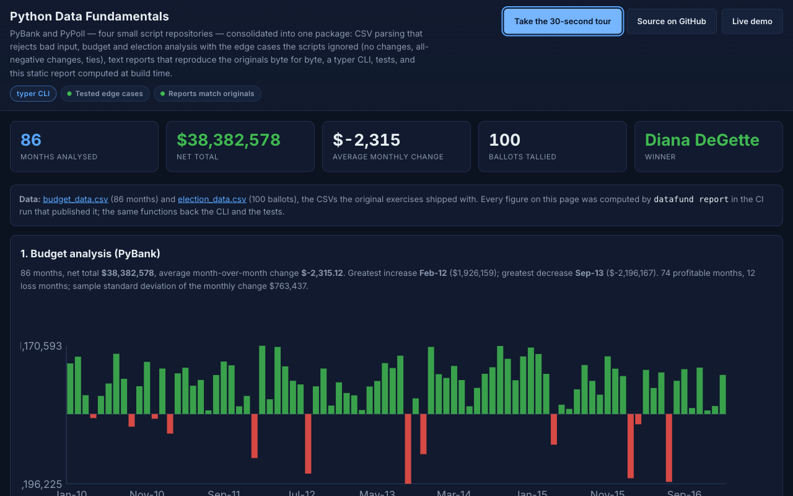

# python-data-fundamentals: the PyBank and PyPoll exercises as one tested package — CSV parsing that rejects bad input, analyses that handle the edge cases the scripts ignored, reports that match the originals, and a static page computed at build time

[](https://github.com/Freddricklogan/python-data-fundamentals/actions/workflows/deploy.yml)
[](#5-getting-started--verification)
[](https://github.com/Freddricklogan/python-data-fundamentals/actions/workflows/codeql.yml)
[](LICENSE)
[](https://freddricklogan.github.io/python-data-fundamentals/)

## 1. Executive Summary & Business Impact

**Problem statement.** Four repositories — PyBank, PyPoll,
Election-Analysis and Financial-Analysis — each held one script that
read one CSV from a hard-coded path and printed a block of text. They
were fine as exercises and poor as evidence: no tests, no package, no
way to run them on a different file, and each carried a quiet defect
(a "greatest increase" that could not be negative, a division by zero
on a one-row file, a tie silently awarded to whichever name came
first).

**What this delivers.** One package, `datafund`, with a CLI:
`datafund budget <csv>` and `datafund election <csv>` produce the
same text the originals did — the committed Election-Analysis output is
a test fixture and matches byte for byte — and `datafund report`
renders a static page from the bundled datasets in CI. Parsing
validates headers, columns, integers and duplicate ballot IDs and
names the offending line. Ties are reported as ties. Fourteen tests,
100 % statement coverage, `mypy --strict`.

**Who it is for.** Anyone assessing whether I can take beginner code
and make it correct without making it complicated, and anyone who
wants a small, typed, tested example of a CSV analysis CLI.

**[→ Read the full case study](docs/CASE_STUDY.md)**

## 2. Demonstrated Competencies & Technical Skills

| Area | What the repository shows |
| --- | --- |
| Consolidation | Four scripts folded into two modules and one CLI without losing any original output |
| Edge-case discipline | Empty input, one row, all-negative changes, ties, malformed rows — each has a test and a defined result |
| Faithful reporting | Text reports in the originals' exact layout; the successor's committed output is the fixture |
| Python 3.12 tooling | `src/` layout, hatchling, typer, frozen dataclasses, ruff, `mypy --strict`, pytest-cov, bandit, pip-audit |
| Static publishing | `report --out dist` renders HTML with the Executive Shell and a strict CSP; Pages deploys the CI build |

## 3. System Architecture & Data Flow

```
data/budget_data.csv ──► budget.parse_budget ──► summarize_budget ──► BudgetSummary
data/election_data.csv ► election.parse_ballots ► tally ──────────► ElectionSummary
                                          │                             │
                     text.budget_text ◄───┘        text.election_text ◄─┘      (CLI output, tests)
                                          │                             │
                     report.render_html ◄─┴─────────────────────────────┘      (dist/index.html + shell)
```

`cli.py` is the only module that prints; everything else returns
values. `budget`, `election` and `text` have no dependencies beyond the
standard library.

## 4. Technical Highlights & Engineering Decisions

- **The original output is the contract.** `election_text` reproduces
  Election-Analysis's block exactly; `budget_text` reproduces PyBank's.
  Where the original had no answer (one row, a tie) the report says so
  in words rather than printing a wrong number.
- **Greatest increase is the max change, not the max positive change.**
  PyBank initialised both trackers at zero, so an all-negative series
  had no greatest increase; here it is the least negative change.
- **Ties are data.** `ElectionSummary.winners` is a tuple; `winner` is
  `None` when it has more than one name, and the text report prints the
  tie. The same applies to county turnout.
- **Volatility needs two changes.** The sample standard deviation is
  `None` for fewer than two changes rather than a `StatisticsError`.
- **One implementation, three consumers.** The CLI, the tests and the
  report page all call the same functions; the page embeds its figures
  as JSON for the shell's KPIs, so nothing is typed in twice.

## 5. Getting Started & Verification

**Prerequisites.** Python 3.12 and `uv`.

```bash
git clone https://github.com/Freddricklogan/python-data-fundamentals.git
cd python-data-fundamentals
uv venv && uv pip install -e ".[dev]"
make check                                   # ruff, mypy --strict, pytest --cov, bandit, pip-audit, build
uv run datafund budget data/budget_data.csv --out analysis/financial_analysis.txt
uv run datafund election data/election_data.csv
uv run datafund report --out dist            # then open dist/index.html
```

**Verification — the numbers this repository actually produced:**

| Check | Result |
| --- | --- |
| Tests (pytest) | **14 passed / 14** |
| Coverage | **100%** statements (240) over `datafund` (CLI excluded) |
| ruff, ruff format, mypy --strict | clean (9 source files) |
| bandit, pip-audit | 0 findings; no known vulnerabilities |
| PyBank dataset | 86 months, total $38,382,578, average change $−2,315.12, greatest increase Feb-12 ($1,926,159), greatest decrease Sep-13 ($−2,196,167) |
| Election-Analysis dataset | 100 ballots, Diana DeGette 69.000%, largest county Denver (49); text output identical to the committed `election_analysis.txt` |
| Report smoke (headless Chrome) | **0 console errors / 0 warnings**; shell mounted, 5 KPIs, 86 bars, 3 tables, tour 3 steps; no horizontal scroll at 1280 or 400 px |

## 6. Live Demo & Production Showcase

**<https://freddricklogan.github.io/python-data-fundamentals/>** — the
report CI built from the bundled datasets, with both CSVs beside it.

**30-second guided walkthrough.** Press **Take the 30-second tour**:
where the data comes from, the budget answers with the swings drawn,
and the tally with ties made visible.



**Replaces.** [PyBank](https://github.com/Freddricklogan/PyBank),
[PyPoll](https://github.com/Freddricklogan/PyPoll),
[Election-Analysis](https://github.com/Freddricklogan/Election-Analysis)
and [Financial-Analysis](https://github.com/Freddricklogan/Financial-Analysis)
remain online with a banner pointing here; [AUDIT.md](AUDIT.md) lists
what each one got wrong.

---

## License

MIT — see [LICENSE](LICENSE).
